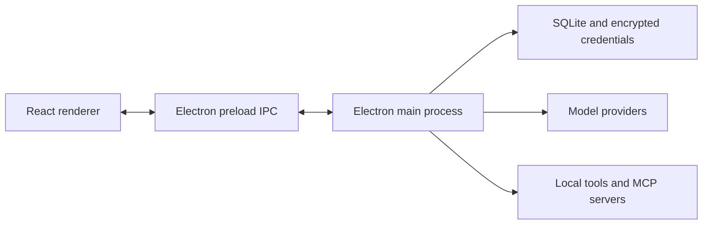

<p align="center">
  
</p>

<h1 align="center">Avi</h1>

<p align="center">
  A local desktop workspace for AI conversations, tools, and orchestration.
</p>

<p align="center">
  <a href="https://avi.aivax.net">Website</a>
  ·
  <a href="https://github.com/aivaxlabs/avi">Source code</a>
</p>

Avi brings model conversations, project context, local tools, MCP servers, and multi-agent workflows into one desktop application. Conversation state is stored locally, while model requests are sent only to the providers you configure.

## Contents

- [Features](#features)
- [Technology](#technology)
- [Architecture](#architecture)
- [Getting started](#getting-started)
- [Provider setup](#provider-setup)
- [Development commands](#development-commands)
- [Tests](#tests)
- [Building a release](#building-a-release)
- [Project structure](#project-structure)
- [Local data and credentials](#local-data-and-credentials)
- [Contributing](#contributing)
- [Project information](#project-information)

## Features

- **Flexible model providers** — connect a ChatGPT subscription through OAuth or configure OpenAI-compatible Responses and Chat Completions endpoints.
- **Project-aware conversations** — organize chats by folder, fork threads, search history, attach files, and switch between configured models.
- **Local tools** — let agents inspect files, search code, read URLs, and run terminal commands with configurable approval controls.
- **MCP integration** — manage global and project-specific Model Context Protocol servers, including local and remote transports.
- **Context management** — inspect the instructions, skills, workflows, and memory files available to each workspace.
- **Agent orchestration** — coordinate side chats and sub-agents, inspect active work, and deliver results back to parent conversations.
- **Execution modes** — use Plan, Goal, and Ultra modes for investigation, persistent objectives, and coordinated multi-agent work.
- **Local persistence** — keep conversations, preferences, goals, and orchestration state in a local SQLite database.

## Technology

- [Electron](https://www.electronjs.org/) for the desktop runtime and [electron-builder](https://www.electron.build/) for installers
- [Bun](https://bun.sh/) for package management and development/build scripts
- [React](https://react.dev/) for the renderer
- [Vite](https://vite.dev/) for renderer builds
- [Cascadium](https://github.com/cypherpotato/cascadium) for stylesheet compilation
- [Model Context Protocol SDK](https://github.com/modelcontextprotocol/typescript-sdk) for MCP integrations

## Architecture



The renderer owns the user interface. The main process owns persistence, provider requests, tool execution, context discovery, and MCP connections. Communication crosses an isolated Electron preload boundary exposed as `window.chatApp`; renderer code does not receive direct Node.js or `ipcRenderer` access.

## Getting started

### Prerequisites

- [Bun](https://bun.sh/) installed and available in your terminal
- Git
- A supported Windows, macOS, or Linux desktop environment

### Install and run

```bash
git clone https://github.com/aivaxlabs/avi.git
cd avi
bun install
bun run dev
```

To open the renderer developer tools:

```bash
bun run dev:devtools
```

During development only, pass `--skip-single-instance` when parallel Avi instances are required:

```bash
bun run dev --skip-single-instance
```

No environment variables are required for normal development. Providers and MCP servers are configured inside the application.

## Provider setup

Open **Settings → Providers**, then choose one of the supported connection types:

### OpenAI Subscription

Connect a ChatGPT account through the browser-based OAuth flow. Supported models are managed by Avi and become available after authorization.

### OpenAI Compatible

Configure a provider that implements either:

- `POST /v1/responses`
- `POST /v1/chat/completions`

Provide the base URL, API key, and models exposed by the service. Model capabilities and reasoning behavior can be adjusted per model.

## Development commands

| Command | Purpose |
| --- | --- |
| `bun run dev` | Build the renderer and start Avi in development mode |
| `bun run dev:devtools` | Start development mode with renderer developer tools |
| `bun run styles` | Compile Cascadium styles into the renderer stylesheet |
| `bun run styles:watch` | Recompile styles when source files change |
| `bun run syntax` | Check JavaScript and JSX syntax |
| `bun run renderer:build` | Compile styles and produce the Vite renderer build |
| `bun run build` | Build the renderer |
| `bun package` | Build the renderer and create an installer for the current platform |
| `bun package --all` | Request Windows, macOS, and Linux installers (use native CI runners for release artifacts) |

## Tests

The repository contains focused test scripts instead of a single aggregate test command:

```bash
bun run test:context
bun run test:plan
bun run test:goal
bun run test:ultra
bun run test:server-retry
bun run test:provider-auth
bun run test:interruptions
bun run test:mcp
bun run test:files
bun run test:side-chat
```

Run the tests relevant to your change, followed by:

```bash
bun run syntax
bun run build
```

## Building a release

The application version is defined in `package.json` and compiled into the renderer and desktop package.

```bash
bun package
```

Installers are written to `artifacts/`. `bun package --all` requests every configured target, but signed and production-ready artifacts should be generated on native Windows, macOS, and Linux CI runners because DMG signing/notarization, NSIS signing, and Linux packaging tools are platform-specific.

## Project structure

| Path | Responsibility |
| --- | --- |
| `assets/` | Product artwork and platform icons |
| `src/main/` | Desktop process, persistence, tools, IPC, context, and MCP runtime |
| `src/providers/` | Model provider definitions and request implementations |
| `src/renderer/` | React interface and renderer-side APIs |
| `src/styles/` | Cascadium source styles |
| `scripts/` | Development, validation, test, and packaging scripts |
| `package.json` | Electron entry point, metadata, and electron-builder release configuration |
| `src/preload/` | Isolated renderer IPC bridge |
| `vite.config.js` | Renderer build configuration |

## Local data and credentials

Avi stores conversation data and preferences in a local SQLite database. Provider credentials and OAuth tokens are encrypted locally with a key protected by the operating system.

Model prompts, tool calls, and attachments may be sent to the configured model provider when required to complete a request. Review the provider's privacy and retention policies before using sensitive data.

## Contributing

1. Fork the repository.
2. Create a focused branch.
3. Install dependencies with `bun install`.
4. Make the smallest coherent change.
5. Run the relevant tests, syntax check, and build.
6. Open a pull request describing the behavior and validation performed.

Prefer concise changes that preserve existing behavior and keep provider-specific logic inside `src/providers/`.

## Project information

- Website: [avi.aivax.net](https://avi.aivax.net)
- Repository: [github.com/aivaxlabs/avi](https://github.com/aivaxlabs/avi)
- Created by [AIVAX Labs](https://aivax.net)
- License: no license file is currently included in this repository
