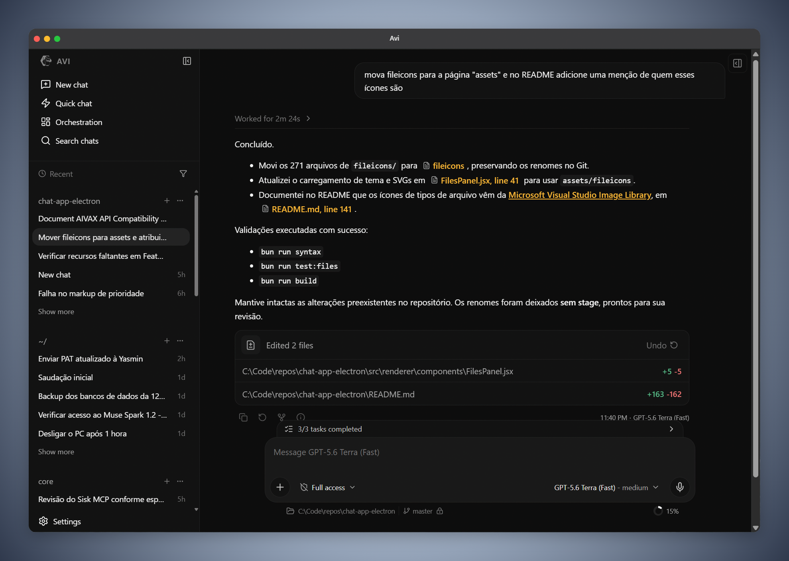

<p align="center">
  
</p>

<h1 align="center">Avi</h1>

<p align="center">
  A local desktop workspace for AI conversations, tools, and orchestration.
</p>

<p align="center">
  <a href="https://avi.aivax.net">Website</a>
  ·
  <a href="https://github.com/aivaxlabs/avi">Source code</a>
</p>

Avi is a harness built from scratch which brings model conversations, cross-provider communication, project context, local tools, MCP servers, multi-agent workflows, and autonomous bots into one desktop application. Conversation state is stored locally, while model requests are sent only to the providers you configure.

<p align="center">
  
</p>

## Features

- **Light**: small footprint compared to other harnesses
  - Low RAM and CPU consumption with multiple agents working
  - Fast startup, launches with the system
  - Few dependencies, easy to maintain
- **Multiple providers**: connect multiple AI providers and customize the models you’ll use for each provider.
  - OpenAI Subscription: your ChatGPT subscription – no need for Codex ACP
  - GPT-6 Astra subscription models, including Fast variants with image input and reasoning efforts
  - OpenAI-Compatible endpoints: /v1/responses and /v1/chat/completions
  - Model-specific settings: capabilities, reasoning supported
  - Optional hyperparameters: temperature and top-k forwarded to OpenAI-compatible Responses and Chat Completions requests
  - Model routers: fallback and round-robin routing across providers
- **Extensible**:
  - Plugins allow providing providers, themes, auxiliary panels, commands, skills, and many features for Avi.
  - Install trusted `.js` or `.zip` extensions from Settings, with controls to enable, disable, replace, and remove packages.
  - Extend Avi with context, MCP servers, chat tools, auxiliary panels, themes, personalities, and model providers.
  - Trusted plugins integrate lifecycle hooks, domain APIs, storage, tools, events, interceptors, provider panels, and bot capabilities.
  - Plugins can declare settings sections rendered by Avi and backed by JSON Schema validation.
  - Plugin packages are validated before installation and loaded atomically at startup.
  - Child Processes plugin: start supervised command lines with Avi, with per-process start, stop, and restart controls, retries, and rotating stdout/stderr logs.
- **AIVAX Features**: optional integration for persistent memory, advanced web tools, and remote conversation-search reranking.
  - Connect an AIVAX account and choose which external capabilities to enable.
  - Agents can search, write, and delete persistent memory; fetch rich web content; and search the web with filters.
  - Semantic search across your threads and conversations.
  - Teach Skill: turn an attached tutorial video into reusable Avi skill instructions.
- **Powerful sub-agents**:
  - Sub-agents can actively communicate with the orchestrator and other sub-agents.
  - Define sub-agent levels: model + reasoning per sub-agent invocation level (low, medium, high), lets you choose which models and providers will run different task types
  - Active communication: sub-agents can send messages to the orchestrator and other sub-agents while working, and vice versa.
  - Sub-agent view panel: track sub-agent progress via the side panel.
- **Powerful orchestration**:
  - Start, inspect, and converse with parallel threads: agents can view conversations, work folders, tasks, monitor and supervise other agents.
  - Shared semaphore queues by agents to order long tasks among agents.
  - Remote MCP: persistent server that provides orchestration tools to connect to external services (Claude, ChatGPT, etc.)
  - Overview page: opens on Inbox by default with a searchable, status-filtered list of bot conversations, plus ongoing tasks and consumption insights.
- **Remote control (ORPC RPC API)**:
  - Global WebSocket with administrative handlers plus isolated per-thread WebSockets for bidirectional conversation control and events, over the binary ORPC Draft 2 protocol (`avi-orpc-draft2`) with multipart UTF-8 JSON operation envelopes, bounded reconstruction, and Avi CHECKSEND SHA-256 integrity validation.
  - Browser clients authenticate with API keys (no URL secrets); discovery reports methods, capabilities, versions, and the model catalog.
  - Multiple labelled API keys with optional expiration, managed independently.
  - Opt-in WAN bridge through the public relay with AIVAX-authenticated tickets and a stable per-install device id; only RPC streams are relayed.
- **Autonomous bots**:
  - Scheduled agents that activate automatically and keep working on their own working folder.
  - Persistent work state: planned, ongoing, blocked, user-review, discarded, and completed work with typed evidence and explicit next steps.
  - Inbox and Activity: bots ask for input through Inbox conversations you answer in place (text, images, files); Activity is the bot's first-person diary of important work.
  - Work queues: ordered round-robin tasks, activation windows, an **Activate now** queue picker to keep or select the next task, and per-bot snoozing for 1h, 6h, 24h, or until Avi restarts.
  - Attention notifications in the sidebar, with distinct indicators for working, sleeping, active, and disabled bots.
  - Agents can create, update, and manage bots themselves with dedicated bot tools.
- **MCP client**:
  - MCP client scoped globally or per project
  - MCP control panel: view MCP tools, provided instructions
  - Isolation: separate MCP servers by folder or globally
  - Diagnostics: visually check servers that failed or are slow to start
- **Linked-folder workspaces**:
  - Combine multiple folders into one workspace under `~/.aivax/workspaces` using directory symlinks, with per-workspace context, skills, workflows, and MCP configuration.
  - File search, composer mentions, and Git diffs follow symlinks; linked folders can be renamed, removed, or repaired from the sidebar without touching their targets.
- **Context management and discovery**:
  - Advanced discovery of skills, workflows, and instructions
  - Recursive context listing: searches for skills and workflows in the current folder and globally (in $HOME/.agents) without the agent having to search
  - Automatic contextualization: injects AGENTS.md, MEMORY.md, AGENTS.foobar.md... automatically into the agent’s context.
  - Slash commands: invoke workflows with /command and skills via $skill in the composer.
  - Context panel: manage skills, workflows and instructions findable by the agent.
  - Composer mentions: type `@` to attach project files and directories, enabled MCP servers, or `@thread` and `@memory` context.
- **Advanced inference**:
  - Very large tool results are truncated and written to files
  - Agent can query large tool outputs with tools.
  - Native tools for file reading, media reading (images, PDFs) and file writing (encoding‐sensitive).
  - Automatic retry for server and provider errors.
  - Queue and steer mechanism for advanced chat.
  - Execution permission level for potentially dangerous tools (ask for approval, allow for me, full access).
  - Structured agent questions support single-choice, multiple-choice, free-text, and custom answers.
  - Automatic context compression on provider errors (context_length_exceeded) or when reaching user‐defined threshold.
  - Context usage details: the composer indicator opens a segmented estimate (instructions, global context, tools, messages, tool results, overhead, grouped by MCP server).
  - Quick context compaction: drop tool results older than the latest four turns via Context usage or `/quick-compress`, alongside the `/compress` full checkpoint flow.
  - Resume button on stopped or failed chats, which continue from the last assistant turn.
  - Configurable response verbosity: low, medium, or high verbosity for injected assistant instructions.
  - Trace + Requests diagnostics: a log mode that records the raw HTTP request and response of failed provider calls with secrets redacted.
  - Improve your prompts and their clarity with /optimize-prompt, which also translates them to English.
- **Rich chat content**:
  - Assistant messages can render callouts, diffs, diagrams, equations, and bar, line, and pie charts.
  - Workspace file excerpts and copyable text blocks rendered inline in the conversation.
- **Goals and targets**:
  - Goals can be started with /goal or by the agent itself.
  - Helper model expands the goal with completion criteria, execution rules, and relevant meta‐information.
  - Model loops until the condition is met.
  - *Infinite* inference retry with long timeout for provider errors, rate‐limits, or server not interrupting the goal.
- **Ultra mode**:
  - Aggressive delegation mode of sub‐agents to different solution‐exploration fronts.
  - Has a rigid workflow of recognition, judgment, and refinement of the work done.
  - Can consume many more tokens.
  - Can be used together with goals.
- **Plan mode**:
  - Agent uses sub‐agents to create an execution plan for a task.
  - Delegates sub‐agents for exploration, research, and independent checks to refine the plan.
  - Instructs sub‐agents to talk actively with each other to reach a consensus.
  - Plan and Ultra selections persist with each conversation until disabled.
- **Rubber Duck reviews**:
  - Fork the current conversation into a read-only judgment session where a supervisor model interviews the agent.
  - Returns the discussed points and a proposed execution plan before anything is executed.
- **Quick chat and side chats**:
  - Side chats: fork the current conversation into a quick side chat to ask about the agent’s work without interrupting the main chat. Side chats can direct, orchestrate, and assist the main agent and its sub‐agents.
  - Quick chats: minimalist quick chat for fast questions unrelated to any thread or folder.
- **Side panel**:
  - View files, git changes in the side panel
  - Tag conversations and color-code folders
  - View tasks started by the agent during its threads
  - View provider limits and consumption in the side panel, or inspect usage from the composer with /usage (OpenAI Subscription, AIVAX, and plugin sources)
- **Archive and retention**:
  - Search, restore, or permanently delete archived conversations.
  - Configure automatic retention for regular and disposable conversations.
  - Review storage usage, force cleanup, and clear temporary attachments, tool outputs, logs, and cached media.
- **Automatic updates**:
  - Installed builds check stable GitHub releases at startup and every six hours, flag Settings when an update is available, and install the matching platform asset from a banner in Settings → General.
- **Customizable**:
  - Choose different personalities for the chat (friendly, candid, cynical, etc.)
  - Choose interface themes
  - Optional sidebar transparency: Tabbed Mica on Windows 11, Acrylic on Windows 10, native vibrancy on macOS
  - Choose custom wallpapers in chat.

Planned features (roadmap):
- Pets!
- Computer use tools
- Side browser panel
- Terminal auxiliary panel (to view running background terminals and inspect them)
- Improve /ultra mode
- Add more providers (Cursor, Claude Code, Antigravity)
- Mobile app (PWA)

## Supported providers

For now, you can configure inference providers with the internal providers:
- OpenAI chat/completions API
- OpenAI responses API
- OpenAI Subscription (Codex)

OpenAI Subscription is the only AI subscription that allows OAuth2 and consuming its API directly, so we do not provide support for Claude Code or Antigravity.

These providers allow use via ACP command line to avoid being banned; however, ACP‐based providers are problematic for use in Avi because:
- they have their own function sets;
- they do not allow expanding their tools, instructions, or context directly;
- they control their session lifecycle internally.

For Avi to work well, it needs full freedom with the provider, including providing instructions, tools, controlling sessions and messages.

If you think this is a mistake, you can:
- create a plugin with your provider; test it
- fork Avi and open a PR with a new provider.

For subscriptions like Kimi Code, GLM, Xiaomi, Qwen, all provide an API compatible with OpenAI Responses or Chat completions, which makes it easy to "plug" the model directly into Avi.

## Getting started

### Prerequisites

- [Bun](https://bun.sh/) installed and available in your terminal
- Git
- A supported Windows, macOS, or Linux desktop environment

### Install and run

```bash
git clone https://github.com/aivaxlabs/avi.git
cd avi
bun install
bun run dev
```

Runtime diagnostic flags can be passed together or separately:

- `--inactive-bots`: starts Avi without starting the bot scheduler or resuming interrupted bot runs.
- `--memory-trace`: writes process CPU, memory, and disk I/O samples to `~/.aivax/trace.log` every 250 ms.

During development:

```bash
bun run dev --inactive-bots --memory-trace
```

With an installed or packaged Windows executable:

```powershell
& "C:\Path\To\Avi.exe" --inactive-bots --memory-trace
```

No environment variables are required for normal development. Providers and MCP servers are configured inside the application.

## Provider setup

Open **Settings → Providers**, then choose one of the supported connection types:

### OpenAI Subscription

Connect a ChatGPT account through the browser-based OAuth flow. Supported models are managed by Avi and become available after authorization.

### OpenAI Compatible

Configure a provider that implements either:

- `POST /v1/responses`
- `POST /v1/chat/completions`

Provide the base URL, API key, and models exposed by the service. Model capabilities and reasoning behavior can be adjusted per model.

## Contributing

1. Fork the repository.
2. Create a focused branch.
3. Install dependencies with `bun install`.
4. Make the smallest coherent change.
5. Run the relevant tests, syntax check, and build.
6. Open a pull request describing the behavior and validation performed.

Prefer concise changes that preserve existing behavior and keep provider-specific logic inside `src/providers/`.

## Credits

- Created by [AIVAX Labs](https://aivax.net)
- File type icons: [Microsoft Visual Studio Image Library](https://learn.microsoft.com/en-us/visualstudio/designers/the-visual-studio-image-library?view=vs-2022)
