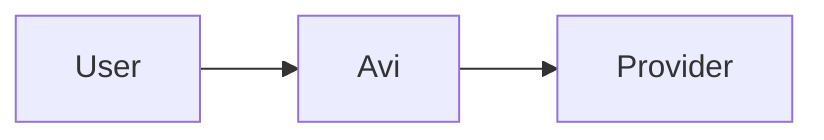

# Rich Chat Visualization

Avi recognizes restricted Markdown Directives in assistant messages. Use them only when the richer presentation improves comprehension or provides a useful copy target. Ordinary prose, tables, code fences, and inline `fileref` directives remain preferable for simple responses.

Use each directive in its documented form. Do not wrap the outer directive in a Markdown code fence. Arbitrary HTML and unknown directives are not rendered as Avi components.

## File references

Use the inline `fileref` text directive to reference a real workspace-relative file:

```markdown
See :fileref{path="./src/main/runtime.js" line-from="120" line-to="128"}.
```

- `path` is required and must begin with `./` or `../`.
- `line-from` is optional and must be a positive integer.
- `line-to` is optional, requires `line-from`, and must be greater than or equal to it.
- Keep the directive outside code spans and code fences.

## Callouts

Use a `callout` leaf directive as a short visual heading. Put supporting Markdown in the following paragraphs.

```markdown
::callout[Back up the database before continuing.]{kind="warning"}
```

- `kind` is optional and defaults to `info`.
- Supported kinds: `info`, `success`, `warning`, and `danger`.
- The label supports inline Markdown and must remain concise.
- Do not use a container `:::callout`; it is not supported.

## Charts and progress

Use the `avi-chart` leaf directive for bar, line, pie, or progress charts. Use single quotes around `data` so its JSON can retain double quotes.

```markdown
::avi-chart{type="bar" title="Requests by method" data='[{"label":"GET","value":128},{"label":"POST","value":64}]'}
```

```markdown
::avi-chart{type="progress" title="Release readiness" data='[{"label":"Tests","value":83,"max":100},{"label":"Docs","value":6,"max":8}]'}
```

- `type` is required: `bar`, `line`, `pie`, or `progress`.
- `title` is optional and defaults to `Chart` or `Progress`.
- Supply 1–24 items with short, unique labels.
- `bar`, `line`, and `pie` items require a finite, non-negative `value`.
- `progress` items require finite numbers with `max > 0` and `0 <= value <= max`.
- Preserve the intended item order. Do not use colors, markup, expressions, `NaN`, `Infinity`, negative values, or nested datasets.

## Diffs

Use an `avi-diff` container containing exactly one fenced `diff` code block.

````markdown
:::avi-diff{title="Focused change"}
```diff
@@ -1,2 +1,2 @@
-const enabled = false;
+const enabled = true;
```
:::
````

- `title` is optional and defaults to `Diff`.
- The body must contain exactly one non-empty `diff` fence and no other content.
- Use this for focused excerpts, not entire large patches.

## Mermaid diagrams

Use a `mermaid-diagram` container containing exactly one fenced `mermaid` code block.

````markdown
:::mermaid-diagram

:::
````

- Keep diagrams concise and self-contained.
- Do not include links, HTML labels, scripts, event handlers, or external assets.
- Avi loads Mermaid only when needed, uses strict mode, sanitizes the SVG, and shows source fallback if rendering fails.

## LaTeX and KaTeX

Use the `latex` leaf directive for a compact equation and the container directive for a display equation. The leaf directive is still a block and must start on its own line.

```markdown
::latex[E = mc^2]
```

```markdown
:::latex
\frac{-b \pm \sqrt{b^2 - 4ac}}{2a}
:::
```

- KaTeX runs locally with trust disabled and emits HTML plus MathML.
- Do not use HTML, URLs, external resources, or trusted commands in equations.
- Use ordinary prose around equations; do not put `::latex` in the middle of a paragraph.

## File mentions

Use the `avi-file-mention` container directive to display Markdown that points to a real workspace-relative file.

````markdown
:::avi-file-mention{path="./src/main/runtime.js" line-from="120" line-to="128" language="js"}
The relevant implementation contains **Markdown context** and code:

```js
const result = await runner.execute(request);
return result;
```
:::
````

- `path` is required and must begin with `./` or `../`.
- `line-from` is optional and must be a positive integer.
- `line-to` is optional, requires `line-from`, and must be greater than or equal to it.
- `language` is optional. If omitted, Avi derives it from the file extension.
- Include only content actually read from that file and keep line attributes aligned with it.
- Use `:fileref{path="./file.js" line-from="12" line-to="18"}` when the excerpt itself does not need to be visible.

## Copyable text

Use the `avi-copy` leaf directive for commands, prompts, configuration fragments, identifiers, or other plain text the user is likely to copy as a unit.

```markdown
::avi-copy{label="Command" value="bun run renderer:build"}
```

- `label` is optional and defaults to `Copyable text`.
- `value` is required and must not be empty.
- The value is displayed as plain preformatted text, not Markdown or executable HTML.
- Do not use this directive for secrets, credentials, hidden reasoning, or sensitive data.

## Findings

Use the `finding` leaf directive as the heading for a prioritized review, security, or audit finding. Put evidence, impact, and recommendation in normal Markdown below it.

```markdown
::finding[Redirects can bypass SSRF protection.]{level="P1"}

**Evidence:** `path:line` or symbol and observed behavior.
**Impact:** realistic consequence and affected users or systems.
**Recommendation:** targeted fix or investigation.
```

- `level` is required: `P0`, `P1`, `P2`, or `P3`.
- The label supports inline Markdown and must remain concise.
- Do not use a container `:::finding`; it is not supported.
- Do not use finding directives for general headings or non-findings.

## Composition and fallbacks

Leaf and container directives must start on their own line. Keep a blank line before and after them. Multiple directives are allowed.

If a directive is malformed, has an unsupported type or attributes, is incomplete while streaming, exceeds its limits, or is placed inside a code fence, Avi leaves it as ordinary Markdown/text instead of activating a component. Never rely on arbitrary HTML, scripts, event handlers, inline styles, external assets, or embedded URLs.
